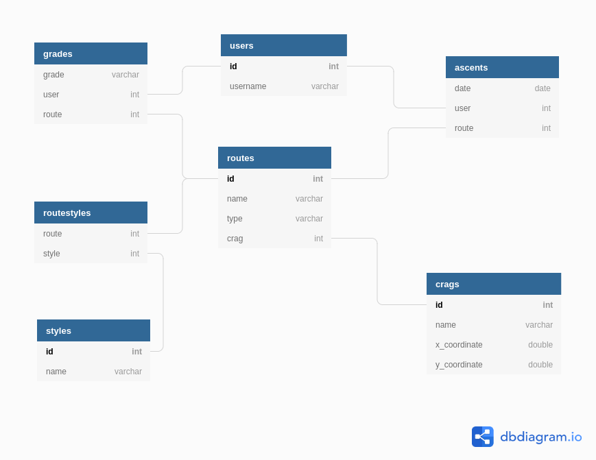

Climb a Rock
===

### Kuvaus

Climb a Rock on tietokanta ulkokiipeilyreiteille. Käyttäjä voi selata ja lisätä paikkoja ja reittejä tietokantaan. Lisäksi käyttäjä voi pitää kirjaa siitä mitä reittejä hän on kiivennyt ja antaa oman arvionsa reitin vaikeustasosta. Sovelluksessa on monipuolinen reitinhakuominasuus jolla voi hakea ja lajitella reittejä esimerkiksi vaikeustason tai nousujen (montako kertaa reitti on kiivetty) perusteella. Jokaisella reitillä on siihen liittyviä kiipeilytyyppi ja tyylejä. Reitti voi olla esimerkiksi negatiivinen, sormekas trädi-reitti (traditiona) tai vaikkapa släbi-tyylinen (slab) boulderi. Sovellus käyttää englanninkieltä koska suomenkielinen kiipeilysanasto on vajavaista.

### Alustava tietokantakaavio

